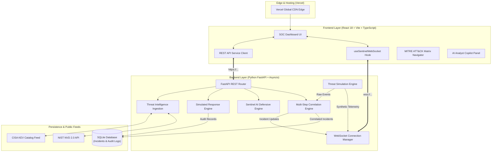

# SENTINEL SOC — Security Operations Center Platform

> **Threat intelligence. Under control.**
> A professional, production-grade cybersecurity Security Operations Center (SOC) platform integrating real-world threat intelligence (NIST NVD + CISA KEV), live telemetry streaming via WebSocket, automated multi-stage incident correlation, MITRE ATT&CK® enterprise coverage mapping, AI defensive triage copilot, and safe simulated containment playbooks.

---

## 🏛️ System Architecture



---

## ✨ Core Capabilities

1. **Real-World Threat Intelligence (NIST NVD + CISA KEV)**:
   - Live synchronization with NIST NVD API 2.0 with CVSS v3.1/v4.0 scoring, CWE classifications, and affected CPE products.
   - Direct ingestion of the official **CISA Known Exploited Vulnerabilities (KEV)** catalog (~1,675+ CVEs).
   - Real-time cross-referencing: Enriches NVD records with active KEV exploit indicators, remediation due dates, and ransomware campaign usage.
   - Resilient in-memory TTL caching with offline baseline datasets ensuring 100% uptime during upstream NIST outages.

2. **Real-Time WebSocket Event Bus & Telemetry Broadcaster**:
   - Resilient WebSocket connection manager with heartbeat ping/pong latency measurement, automatic exponential backoff (1s $\to$ 16s), and initial state synchronization.
   - High-fidelity synthetic security events (`BRUTE_FORCE`, `EXPLOIT_ATTEMPT`, `PORT_SCAN`, `SUSPICIOUS_LOGIN`, `POWERSHELL_EXECUTION`, `RANSOMWARE_ACTIVITY`, `DATA_EXFILTRATION`).
   - Clearly labeled with `simulation: true` and private non-routable IP addresses (`10.0.x.x` / `192.168.x.x`).

3. **6 End-to-End Multi-Step Attack Scenarios**:
   - **Password Spray & Brute Force Chain** (`T1110` / `T1078` / `T1059.001` / `T1071.001`)
   - **Web Application Exploit Chain (CVE-2023-34362 MOVEit / SQLi)** (`T1046` / `T1595.002` / `T1190` / `T1059.001` / `T1068`)
   - **Network Reconnaissance & Service Discovery** (`T1046` / `T1595.002`)
   - **PowerShell Injection & Privilege Escalation** (`T1059.001` / `T1562.001` / `T1055` / `T1068`)
   - **Lateral Movement & Ransomware Deployment** (`T1078` / `T1021.002` / `T1490` / `T1486`)
   - **Database Compromise & Data Exfiltration** (`T1110.001` / `T1078` / `T1005` / `T1041`)

4. **Multi-Step Incident Correlation Engine**:
   - Clusters multi-stage telemetry into single evolving incidents with dynamic attack stage tracking, source IPs, affected targets, and duration timestamps (`first_seen` $\to$ `last_seen`).
   - Incident lifecycle management: `OPEN` $\to$ `INVESTIGATING` $\to$ `CONTAINED` $\to$ `RESOLVED` backed by SQLite persistence.
   - Full-text search and filtering across incident titles, targets, source IPs, and MITRE techniques.

5. **Sentinel AI Copilot (4-Tier Grounded Evidence Contract)**:
   - Grounded defensive triage engine with zero-configuration expert heuristics and optional external LLM integration.
   - **4-Tier Structured Breakdown**:
     - 🟢 **OBSERVED (Facts)**: Verifiable telemetry observations directly from ingested logs.
     - 🟡 **INFERRED (Analysis)**: Probabilistic threat assessments and attacker objective deductions.
     - ⚪ **UNKNOWN (Blind Spots)**: Explicitly identified data gaps preventing hallucinated claims.
     - 🔵 **RECOMMENDED (Playbooks)**: Actionable containment, forensic investigation, and hardening runbooks.
   - Complete auditability metadata (`incident_id`, `generated_at`, `model_engine`, `evidence_count`).

6. **Enterprise MITRE ATT&CK® Matrix Coverage**:
   - Full matrix visualization across all 14 Enterprise Tactics (*Reconnaissance*, *Resource Development*, *Initial Access*, *Execution*, *Persistence*, *Privilege Escalation*, *Defense Evasion*, *Credential Access*, *Discovery*, *Lateral Movement*, *Collection*, *Command and Control*, *Exfiltration*, *Impact*).
   - Visual differentiation of `OBSERVED` (active incident techniques), `SIMULATED` (available in scenario catalog), and `NOT_OBSERVED` states.

7. **Safe Simulated Containment & Audit Logging**:
   - One-click simulated response actions: `[ SIMULATE IP BAN ]`, `[ SIMULATE FIREWALL BLOCK ]`, `[ SIMULATE CREDENTIAL REVOCATION ]`, `[ SIMULATE HOST ISOLATION ]`.
   - Immutable audit trail persisted in SQLite with timestamps, action IDs, targets, and simulated execution outcomes.

---

## 📊 Data Honesty & Boundary Classification

| Subsystem / Feature | Data Source | Classification | Verification |
| :--- | :--- | :--- | :--- |
| **Security Telemetry** | Python Simulation Engine | `SIMULATED` | Labeled with `SIMULATION` badge; uses private IP addresses (`10.0.x.x`, `192.168.x.x`). |
| **Attack Scenarios** | Scenario Engine | `SIMULATED` | Multi-step educational attack chains; explicitly labeled. |
| **Correlated Incidents** | Correlation Engine + SQLite | `DERIVED (Simulated)` | Aggregated from sliding-window telemetry; labeled `CORRELATION ENGINE`. |
| **NVD Vulnerability Intel** | NIST NVD API 2.0 Feed | `LIVE` / `CACHED` | Real-world vulnerability records with official CVSS scores and advisories. |
| **CISA KEV Catalog** | Official CISA KEV JSON Feed | `LIVE` / `CACHED` | Real-world catalog of 1,675+ actively exploited CVEs. |
| **AI Analyst Assessment** | Sentinel AI Copilot Engine | `INFERRED` + `DERIVED` | Clear distinction between ground-truth observed facts and probabilistic inferences. |
| **Response Actions** | Response Service | `SIMULATED` | Strictly simulated containment; zero modifications to real network infrastructure. |

---

## 📡 API Reference

### Health & Aggregation
| Method | Endpoint | Description |
|---|---|---|
| `GET` | `/` | API status and service metadata |
| `GET` | `/health` | Real-time system health check across API, database, AI engine, and event bus |
| `GET` | `/api/dashboard` | Aggregated SOC counts (critical, high, active incidents, cached CVEs) |

### Vulnerability Intelligence
| Method | Endpoint | Query Parameters | Description |
|---|---|---|---|
| `GET` | `/api/vulnerabilities` | `search`, `severity`, `kev_only`, `limit`, `offset`, `force_refresh` | Enriched NVD CVEs cross-referenced with CISA KEV |
| `GET` | `/api/vulnerabilities/kev` | `search`, `ransomware_only`, `limit`, `offset`, `force_refresh` | Official CISA KEV catalog |

### Incident Management
| Method | Endpoint | Description |
|---|---|---|
| `GET` | `/api/incidents` | List active correlated incidents (`status`, `severity`, `search` filters) |
| `GET` | `/api/incidents/{id}` | Detailed incident investigation dossier |
| `PATCH` | `/api/incidents/{id}/status` | Update incident status (`OPEN`, `INVESTIGATING`, `CONTAINED`, `RESOLVED`) |
| `POST` | `/api/incidents/{id}/ai-triage` | Trigger Sentinel AI defensive triage on incident |

### Response & MITRE Matrix
| Method | Endpoint | Description |
|---|---|---|
| `POST` | `/api/response/simulate-action` | Execute simulated containment action (`IP_BAN`, `FIREWALL_BLOCK`, `CREDENTIAL_REVOCATION`, `HOST_ISOLATION`) |
| `GET` | `/api/response/audit-log` | Retrieve history of executed simulated response actions |
| `GET` | `/api/mitre/matrix` | Full Enterprise MITRE ATT&CK matrix coverage with active telemetry correlation |

### Telemetry & WebSocket
| Method | Endpoint | Description |
|---|---|---|
| `GET` | `/api/threats` | List recent simulated telemetry events |
| `POST` | `/api/ai/analyze` | Sentinel AI defensive triage on arbitrary event/telemetry payload |
| `WS` | `/ws/events` | Real-time WebSocket event bus and scenario trigger bus |

---

## 🧪 Automated Test Suite (34/34 Passing)

The project includes an end-to-end integration and stress test suite covering all REST endpoints, WebSocket protocols, correlation logic, AI contracts, and simulated responses:

```powershell
cd sentinel-soc/backend
$env:PYTHONPATH='.'
.\.venv\Scripts\python.exe test_suite.py
```

### Test Coverage Highlights:
- ✅ REST API endpoints & health checks (`GET /`, `GET /health`, `GET /api/dashboard`)
- ✅ NVD & CISA KEV cross-referencing precision and fallback resilience
- ✅ 6 end-to-end attack simulation chains
- ✅ Multi-step incident correlation and concurrent attack isolation
- ✅ Incident lifecycle management & SQLite persistence across server reloads
- ✅ Sentinel AI 4-tier grounded evidence contract (`OBSERVED`, `INFERRED`, `UNKNOWN`, `RECOMMENDED`)
- ✅ Simulated automated response safety (`IP_BAN`, `FIREWALL_BLOCK`, `CREDENTIAL_REVOCATION`, `HOST_ISOLATION`)
- ✅ Response action audit log persistence
- ✅ MITRE ATT&CK Matrix coverage aggregation
- ✅ WebSocket protocol handshake, initial state sync, and ping/pong latency measurement

---

## 🚀 Local Development Setup

### 1. Prerequisites
- **Node.js**: v18+ (tested on Node v20/v22)
- **Python**: v3.10+ (tested on Python 3.11/3.12)

### 2. Backend Setup
```powershell
cd sentinel-soc/backend

# Create & activate virtual environment
python -m venv .venv
.\.venv\Scripts\Activate.ps1

# Install dependencies
pip install -r requirements.txt

# Run backend server
uvicorn app.main:app --reload --port 8000
```

### 3. Frontend Setup
```powershell
cd sentinel-soc/frontend

# Install dependencies
npm install

# Run Vite dev server
npm run dev
```

- **Frontend Dashboard**: `http://localhost:5173`
- **Backend API & Swagger Docs**: `http://localhost:8000/docs`
- **Health Check**: `http://localhost:8000/health`

---

## 🚢 Production Deployment

- **Production Frontend**: [https://sentinel-soc1.vercel.app/](https://sentinel-soc1.vercel.app/)
- **Production Backend**: [https://sentinel-soc-api-qpzg.onrender.com](https://sentinel-soc-api-qpzg.onrender.com)
- **Production WebSocket**: `wss://sentinel-soc-api-qpzg.onrender.com/ws/events`

---

## 🛡️ Educational & Safety Disclaimer

> **IMPORTANT**: Sentinel SOC is an educational platform. All telemetry events generated by the simulation engine are strictly **synthetic** and labeled `simulation: true`. Attacker source IPs utilize private, non-routable address blocks (`10.0.x.x`, `192.168.x.x`, `172.16.x.x`). All containment actions (IP bans, firewall blocks, credential revocations, host isolations) operate exclusively in **simulation mode** with audit logs and never modify actual production infrastructure.

