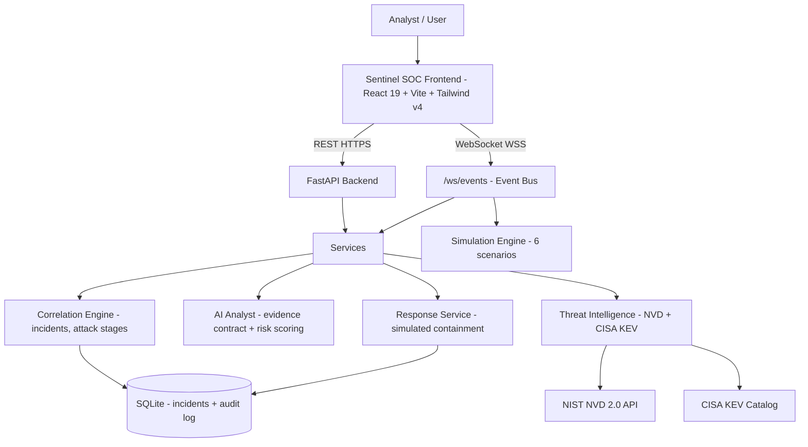

# Sentinel SOC v2.2

**Threat intelligence. Under control.**

A portfolio-grade Security Operations Center (SOC) platform that combines
**real-time telemetry simulation**, **automated incident correlation**,
**live threat intelligence** (NIST NVD + CISA KEV), **MITRE ATT&CK® mapping**,
a **grounded AI defensive analyst**, and **safe simulated response** — all
wrapped in a modern React command center and deployed to production.

> **Educational system.** All telemetry, incidents, and response actions are
> simulated or derived from public threat-intelligence feeds. The platform
> never touches real infrastructure.


- **Production frontend**: https://sentinel-soc1.vercel.app/
- **Production backend (API)**: https://sentinel-soc-api-qpzg.onrender.com
- **Production WebSocket**: `wss://sentinel-soc-api-qpzg.onrender.com/ws/events`
- **Repository**: https://github.com/arayan11587kvrsodelhi-oss/sentinel-soc
- **Backend API docs (Swagger)**: `https://sentinel-soc-api-qpzg.onrender.com/docs`

## Overview

Sentinel SOC demonstrates how a modern Security Operations Center works
end-to-end:

1. A **simulation engine** continuously generates realistic multi-step attack
   chains (brute force, web exploitation, ransomware, exfiltration…).
2. A **correlation engine** clusters related telemetry into contextual
   incidents with attack-stage tracking and deterministic risk scores.
3. **Live threat intelligence** from NIST NVD and the CISA KEV catalog is
   fetched, cached, cross-referenced, and clearly labelled by data source.
4. Every simulated event and incident is mapped to the **MITRE ATT&CK**
   framework, with an aggregate matrix that honestly reports what has been
   observed vs. simulated vs. not observed.
5. The **Sentinel AI Analyst** produces grounded triage that separates
   *observed facts* from *inferred conclusions* from *unknown factors*.
6. Analysts can execute **simulated containment actions** (IP ban, firewall
   block, credential revocation, host isolation) that are recorded to an
   audit log — and nothing more.

The system runs on **FastAPI + WebSocket** (backend) and **React 19 + Vite +
Tailwind v4** (frontend), persists incident state in **SQLite**, and is
deployed to **Render** and **Vercel**.

## Project Highlights (verified metrics)

Every number below is measured from the actual codebase and its running test
suite — nothing is estimated:

| Metric | Value | Verified by |
|---|---|---|
| REST API endpoints | **14** | `backend/app/api/` route decorators |
| WebSocket endpoints | **1** (`/ws/events`) | `backend/app/api/websocket.py` |
| Attack / detection scenarios | **6** | `SCENARIOS` in `simulation_service.py` |
| MITRE ATT&CK techniques catalogued | **19** | `MITRE_TECHNIQUES` in `mitre_service.py` |
| MITRE tactics covered | **14** | `test_suite.py` #32 |
| Event-type → MITRE mappings | **23** | `EVENT_TYPE_TO_MITRE` in `mitre_service.py` |
| Simulated response action types | **4** | `response_service.py` |
| Automated backend tests | **43** (all passing) | `backend/test_suite.py` |
| Frontend screens | **12** | `frontend/src/App.tsx` |
| Live NVD records served | **40** (`LIVE_NVD`) | `/api/dashboard` |
| Live CISA KEV records served | **1,687** (`LIVE_CISA_KEV`) | `/api/dashboard` |

## Key Capabilities

All capabilities below are implemented in the repository (verified against
source code — see the linked files).

- **Real-time security telemetry** — continuously generated synthetic events
  streamed over WebSocket (`backend/app/services/simulation_service.py`,
  `backend/app/api/websocket.py`)
- **Incident management** — correlated incidents with lifecycle, filtering,
  full-text search, and SQLite persistence (`backend/app/services/correlation_service.py`)
- **Incident investigation** — incident detail view with evidence, techniques,
  and recommended actions (`frontend/src/screens/IncidentInvestigation.tsx`)
- **AI-assisted security analysis** — grounded evidence contract with
  observed/inferred/unknown separation (`backend/app/services/ai_service.py`)
- **Threat intelligence** — aggregated NVD + CISA KEV dashboards
  (`frontend/src/screens/ThreatIntelligence.tsx`, `Vulnerabilities.tsx`)
- **NVD integration** — NIST NVD 2.0 API with cache and fallback
  (`backend/app/services/nvd_service.py`)
- **CISA KEV integration** — official Known Exploited Vulnerabilities catalog
  with ransomware filtering (`backend/app/services/cisa_service.py`)
- **MITRE ATT&CK mapping** — technique catalog, event-type mapping, and
  aggregate matrix (`backend/app/services/mitre_service.py`, `backend/app/api/routes/response.py`)
- **Detection scenarios** — 6 multi-step attack chains triggerable live from
  the WebSocket client (`SCENARIOS` in `simulation_service.py`)
- **Simulated response** — 4 containment actions, strictly simulated and
  auditable (`backend/app/services/response_service.py`)
- **Audit logging** — SQLite-backed log of every simulated response action
  (`backend/app/api/routes/response.py`)
- **Security event correlation** — multi-step clustering, attack-stage
  progression, and strict scenario isolation (`correlation_service.py`)
- **Health monitoring** — `/health` reports API, WebSocket, database, AI
  engine, and event pipeline status (`backend/app/main.py`)
## Architecture

The system is a clean four-tier web application:

```
             ┌────────────────┐
             │          Sentinel SOC Frontend (React)         │
             │  Overview · Incidents · AI Analyst · Intel ·   │
             │  Live Events · MITRE · Playbooks · Audit ·     │
             │  Vulnerabilities · Detections · Health         │
             └──────────────▲───────────────┬─────────────────┘
                            │ REST (HTTPS)  │ WebSocket (WSS)
                            │               │
             ┌──────────────┴───────────────▼─────────────────┐
             │              FastAPI Backend                   │
             │  api/routes (dashboard, incidents, threats,    │
             │  vulnerabilities, ai, response) + /ws/events   │
             └──────────────▲───────────────┬─────────────────┘
                            │               │
      ┌─────────────────────┼───────────────┼─────────────────────┐
      │  Services layer     │               │                     │
      │  ┌──────────────┐  ┌▼────────────┐ ┌▼───────────┐  ┌──────▼──────┐
      │  │ Simulation   │  │ Correlation │ AI Analyst │  │ Response    │
      │  │ Engine       │  │ Engine      │ (expert /  │  │ Service     │
      │  │ (6 scenarios)│  │ (incidents) │ optional   │  │ (simulated) │
      │  └──────────────┘  └──────┬──────┘ │ LLM)       │  └──────┬──────┘
      │                           │        └────────────┘         │
      │  ┌───────────────────┐    │                                │
      │  │ NVD Service       │    │      ┌──────────────────┐      │
      │  │ (NIST NVD 2.0)    │    └─────►│ SQLite           │      │
      │  ├───────────────────┤           │ (sentinel.db:    │◄─────┘
      │  │ CISA KEV Service  │           │  incidents +     │
      │  ├───────────────────┤           │  response audit) │
      │  │ MITRE Service     │           └──────────────────┘
      │  │ (19 techniques)   │
      │  └─────────┬─────────┘
      └────────────┼────────────────┘
                   ▼
        External intelligence sources
        - NIST NVD 2.0 API (live, 30-min cache)
        - CISA KEV catalog (live, 1-hour cache)
```

Mermaid equivalent (renders on GitHub):



Each layer is decoupled: the frontend talks only to the API/WebSocket layer,
services own their domain logic, and SQLite is the single persistence point for
incident and audit state.

## Technology Stack

Everything listed here appears in `frontend/package.json`,
`requirements.txt`, or `Dockerfile`:

| Layer | Technology | Used for |
|---|---|---|
| Frontend | React 19, React DOM 19 | UI components and application state |
| Frontend | Vite 8, TypeScript 5.7 | Dev server, bundling, type safety |
| Styling | Tailwind CSS v4 (`@tailwindcss/vite`) | Utility-first UI |
| Backend | FastAPI 0.109 (`fastapi[all]`) | REST API, WebSocket, Pydantic schemas |
| Backend server | Uvicorn 0.27 / gunicorn 21.2 | ASGI serving (dev / production) |
| HTTP client | `httpx` (via `fastapi[all]`) | NVD / CISA KEV fetches, optional LLM calls |
| Database | SQLite | Incident + response-audit persistence |
| Runtime | Python 3.11 (Docker), Node.js (Vite) | — |
| Deploy | Vercel (frontend), Render (backend), Docker | Production hosting |
## Data Sources

Understanding where each piece of data comes from is a core design principle.
Every intelligence payload includes a `data_source` field and every telemetry
event includes `simulation: true`.

| Classification | Meaning | Where it appears |
|---|---|---|
| **LIVE** | Fetched from an external source at request time. | `data_source: LIVE_NVD`, `data_source: LIVE_CISA_KEV` — the `/api/vulnerabilities` and `/api/vulnerabilities/kev` endpoints report this after a successful live fetch. |
| **CACHED** | Previously fetched live, served from the in-memory TTL cache. | `data_source: CACHED_NVD` (30-minute TTL) and `data_source: CACHED_CISA_KEV` (1-hour TTL). Both services pre-warm their caches at startup. |
| **SIMULATED** | Synthetic telemetry generated by the application. | All 6 attack scenarios emit events with `simulation: true`, private RFC-1918 source IPs, and fictional internal assets (`auth-gateway.corp.internal`, `dmz-web-portal.corp.internal`, …). Response actions are also simulated. |
| **DERIVED** | Computed by the system from other data. | Correlated incidents (clustered from events), `risk_score` (`severity × confidence`), attack stages, MITRE matrix status (`OBSERVED`/`SIMULATED`/`NOT_OBSERVED`), dashboard aggregates. |
| **INFERRED** | AI analyst conclusions, explicitly separated from observed facts. | `evidence.inferred` and `evidence.unknown` in AI analysis payloads — never mixed with `evidence.observed`. |

This classification means a reader can always tell *whether the system saw
something real, whether it was live or cached, whether it was only simulated,
and whether the AI is certain or guessing.*

> **Fallback datasets.** When the network is unreachable, the NVD and CISA
> services fall back to a bundled dataset of genuinely real CVEs (e.g.
> CVE-2024-3400, CVE-2021-44228) and report `data_source: FALLBACK`. The
> frontend mirrors this with clearly-labelled fallback payloads so the UI
> remains functional offline.

## AI Security Analyst

The AI analyst (`backend/app/services/ai_service.py`) performs **defensive
triage** on events and incidents. It is **not autonomous** — it produces
advisory analysis that an analyst reviews and acts on.

**Evidence contract (4 tiers):**

```json
{
  "observed":   ["... telemetry facts the system actually saw ..."],
  "inferred":   ["... analyst-style conclusions, clearly labelled ..."],
  "recommended":["... suggested next actions ..."],
  "unknown":    ["... factors that cannot be determined ..."]
}
```

**Confidence model:** a deterministic risk score, `severity_weight ×
confidence`, clamped to 0–100, then mapped to a risk level:

| Risk score | Level |
|---|---|
| 90–100 | CRITICAL |
| 70–89 | HIGH |
| 40–69 | MEDIUM |
| 20–39 | LOW |
| 0–19 | INFO |

**Execution modes:**

1. **Expert engine (default, zero-dependency):** "Sentinel AI Expert Defensive
   Engine v3.0" — a transparent rule-based engine covering credential access,
   web exploitation, execution/evasion, ransomware, and exfiltration classes.
   Always available, deterministic, and free.
2. **Optional LLM path:** if `AI_API_KEY` and `AI_API_BASE_URL` are set, an
   OpenAI-compatible chat-completions endpoint is used with a strict
   JSON-schema prompt (`temperature: 0.2`) and defensive-system instructions.

Every response includes provenance metadata (`model`, `source`,
`generated_at`, `evidence_count`) so each analysis is auditable.

## Threat Intelligence

Two live public feeds power the intelligence layer:

### NIST NVD integration

- Fetches CVE records from the NVD 2.0 API (`services.nvd.nist.gov`).
- Parses CVSS scores, CWE, and affected products; cross-references each CVE
  against the CISA KEV catalog (`is_kev`, `kev_details`).
- 30-minute cache TTL; `force_refresh=true` bypasses it.
- Optional `NVD_API_KEY` raises the rate limit.
- Reports `LIVE_NVD` / `CACHED_NVD` / `FALLBACK`.

### CISA KEV integration

- Fetches the official Known Exploited Vulnerabilities catalog
  (`cisa.gov/sites/default/files/feeds/known_exploited_vulnerabilities.json`).
- Supports `ransomware_only` filtering and search across vendor/product/CVE.
- 1-hour cache TTL; `force_refresh=true` bypasses it.
- Reports `LIVE_CISA_KEV` / `CACHED_CISA_KEV` / `FALLBACK`.

Neither feed is ever presented as "your environment's exposure": the
application clearly labels every entry as external public intelligence.
## MITRE ATT&CK

`backend/app/services/mitre_service.py` implements:

- A catalogue of **19 Enterprise techniques** (T1110 Brute Force, T1190
  Exploit Public-Facing Application, T1486 Data Encrypted for Impact, …)
  across **14 tactics** (Reconnaissance, Initial Access, Execution, Defense
  Evasion, Credential Access, Discovery, Lateral Movement, Collection,
  Exfiltration, Impact, …).
- A mapping of **23 event types → ATT&CK techniques**
  (`EVENT_TYPE_TO_MITRE`), so every simulated event and correlated incident
  carries `mitre_technique` metadata.

The `/api/mitre/matrix` endpoint aggregates live state into a status matrix.
Each technique is classified honestly from actual repository state:

| Status | Meaning |
|---|---|
| `OBSERVED` | Linked to at least one currently correlated incident or event in the engine |
| `SIMULATED` | Part of a runnable attack scenario, but not currently observed |
| `NOT_OBSERVED` | Catalogue-only; neither observed nor simulated |

The matrix also reports `incidents_count`, `events_count`, and related
incident IDs per technique.

## Incident Lifecycle

Incidents are created by the correlation engine when related events satisfy a
scenario pattern. Each incident progresses through a validated lifecycle:

```
OPEN → INVESTIGATING → CONTAINED → RESOLVED
```

Status changes are validated (invalid transitions return `400`) and persisted
to SQLite. Incidents carry:

- correlation metadata: `event_ids`, `events_count`, `source_ips`,
  `affected_targets`
- security context: `severity`, `confidence`, `risk`, `risk_score`,
  `mitre_technique` references, `related_cves`
- investigation context: `attack_stage`, `first_seen` / `last_seen`,
  `recommended_actions`, optional `ai_analysis`

The lifecycle, persistence across restarts, and full-text search are all
exercised by the automated test suite.

## Simulated Response

The Response Center (`backend/app/services/response_service.py`) lets an
analyst run containment actions:

| Action type | Simulated effect |
|---|---|
| `IP_BAN` | Boundary gateway drop rule for an attacker IP |
| `FIREWALL_BLOCK` | Perimeter ACL rejecting traffic to/from a target |
| `CREDENTIAL_REVOCATION` | Kerberos/OAuth session expiry + password reset for an identity |
| `HOST_ISOLATION` | EDR network containment on an asset |

**Every action is strictly simulated.** The service:

- performs **no** real network, firewall, OS, or identity changes,
- returns `status: "SIMULATED SUCCESS"` and `simulation: true`,
- writes an immutable-style record to the SQLite `response_actions` table,
  exposed through `/api/response/audit-log`.

This demonstrates the full automated-response *workflow* safely; nothing in
the platform can modify real infrastructure.

## Real-Time Events

The WebSocket event bus (`backend/app/api/websocket.py`) is the heart of the
live experience:

- **`INITIAL_STATE`** — sent on connect: recent events + open incidents
  snapshot.
- **`EVENT`** — a new simulated telemetry event, broadcast to all clients.
- **`INCIDENT_UPDATE`** — incident creation/progression, broadcast live with
  full incident payload.
- **`PING` / `PONG`** — client heartbeat; the frontend pings every 25 s.
- **`TRIGGER_SCENARIO`** — client command to run any of the 6 attack
  scenarios on demand (usable from the UI).

A background task continuously generates correlated telemetry so the stream is
never idle. The frontend client (`SentinelWsManager`) auto-reconnects (4 s
backoff) and subscribes screens to the stream.
## API Reference

Base URL: `https://sentinel-soc-api-qpzg.onrender.com` (local: `http://localhost:8000`).
Interactive OpenAPI docs: `/docs`.

| Method | Endpoint | Description |
|---|---|---|
| GET | `/` | Service info and version |
| GET | `/health` | Health of API, WebSocket, database, AI engine, event pipeline; active WS client count |
| GET | `/api/dashboard` | Aggregated SOC metrics (severity counts, NVD/KEV totals, data sources) |
| GET | `/api/threats` | Recent telemetry events (`severity`, `event_type`, `limit` query) |
| GET | `/api/incidents` | Incidents list (`status`, `severity`, `search` query) |
| GET | `/api/incidents/{incident_id}` | Full incident investigation detail |
| PATCH | `/api/incidents/{incident_id}/status` | Update lifecycle status |
| POST | `/api/incidents/{incident_id}/ai-triage` | Run AI defensive triage on an incident |
| GET | `/api/vulnerabilities` | Enriched NVD CVE intelligence (`search`, `severity`, `kev_only`, `limit`, `offset`, `force_refresh`) |
| GET | `/api/vulnerabilities/kev` | CISA KEV catalog (`search`, `ransomware_only`, `limit`, `offset`, `force_refresh`) |
| POST | `/api/ai/analyze` | AI defensive analysis of an event/incident |
| POST | `/api/response/simulate-action` | Execute a simulated containment action |
| GET | `/api/response/audit-log` | History of simulated response actions |
| GET | `/api/mitre/matrix` | MITRE ATT&CK technique matrix with status aggregation |

## WebSocket

- **Endpoint**: `wss://sentinel-soc-api-qpzg.onrender.com/ws/events`
  (local dev: `ws://localhost:8000/ws/events`)
- **Client-to-server**: `{"type":"PING"}`, `{"type":"TRIGGER_SCENARIO","scenario_id":"..."}`
- **Server-to-client**: `INITIAL_STATE`, `EVENT`, `INCIDENT_UPDATE`, `PONG`

```javascript
// Example client
const ws = new WebSocket("wss://sentinel-soc-api-qpzg.onrender.com/ws/events")
ws.onmessage = (e) => console.log(JSON.parse(e.data))
ws.onopen = () => ws.send(JSON.stringify({ type: "PING" }))
```

## Product Walkthrough

Captures are staged in `docs/screenshots/` — see
[`docs/screenshots/README.md`](docs/screenshots/README.md) for the exact
capture checklist. This section will render each image inline once the
screenshots are added:

1. **Command Center** — `docs/screenshots/01-command-center.png`
   *(Overview dashboard: live metrics, severity charts, active incidents)*
2. **Incident Investigation** — `docs/screenshots/02-incident-investigation.png`
   *(incident detail: timeline, evidence, recommended actions)*
3. **AI Analyst** — `docs/screenshots/03-ai-analyst.png`
   *(grounded triage: observed vs inferred vs unknown)*
4. **Threat Intelligence** — `docs/screenshots/04-threat-intelligence.png`
   *(NVD + CISA KEV with data-source badges)*
5. **Live Events** — `docs/screenshots/05-live-events.png`
   *(WebSocket event stream)*
6. **MITRE ATT&CK** — `docs/screenshots/06-mitre-attack.png`
   *(technique matrix with observed/simulated status)*
7. **Response / Audit** — `docs/screenshots/07-response-audit.png`
   *(simulated playbook execution + audit log)*

```markdown
<!-- Once added, replace the placeholders with:

... -->
```

## Testing

- **Backend**: `python backend/test_suite.py` — **43 integration checks**,
  all passing, covering health, dashboard, NVD/KEV cross-referencing, all 6
  attack scenarios, correlation isolation (including a regression for the
  production INC-101 bug), incident lifecycle + SQLite persistence, the AI
  evidence contract, WebSocket handshake/broadcast, simulated response
  safety, MITRE aggregation, and deterministic risk math.
- **Frontend**: `npm run lint` and `npm run typecheck` (both `tsc --noEmit`),
  plus `npm run build` (production Vite build).

No coverage percentages are claimed; the numbers above are assertion counts
from the actual test run.

## Deployment

| Component | Platform | URL |
|---|---|---|
| Frontend | Vercel | https://sentinel-soc1.vercel.app/ |
| Backend API | Render | https://sentinel-soc-api-qpzg.onrender.com |
| WebSocket | Render | `wss://sentinel-soc-api-qpzg.onrender.com/ws/events` |
| Repository | GitHub | https://github.com/arayan11587kvrsodelhi-oss/sentinel-soc |

The backend is containerized (Dockerfile, non-root user) and launched with
`gunicorn -k uvicorn.workers.UvicornWorker app.main:app` on `${PORT:-8000}`.
The frontend resolves API and WebSocket URLs automatically (localhost vs.
production) and honours `VITE_SENTINEL_API_URL` / `VITE_SENTINEL_WS_URL`
overrides. See also [`CONTRIBUTING.md`](CONTRIBUTING.md) for local setup.
## Project Structure

```
sentinel-soc-v2.2/
├── backend/                        # FastAPI application
│   ├── app/
│   │   ├── main.py                 # App factory, middleware, lifespan, /health
│   │   ├── api/
│   │   │   ├── websocket.py        # /ws/events event bus + background loop
│   │   │   └── routes/
│   │   │       ├── dashboard.py    # GET /api/dashboard
│   │   │       ├── incidents.py    # incidents CRUD + ai-triage
│   │   │       ├── threats.py      # GET /api/threats
│   │   │       ├── vulnerabilities.py  # NVD + KEV endpoints
│   │   │       ├── ai.py           # POST /api/ai/analyze
│   │   │       └── response.py     # simulated action, audit log, MITRE matrix
│   │   ├── models/
│   │   │   └── schemas.py          # Pydantic models + risk math
│   │   └── services/
│   │       ├── simulation_service.py   # 6 attack scenarios
│   │       ├── correlation_service.py  # incidents, SQLite, isolation
│   │       ├── ai_service.py           # expert engine / optional LLM
│   │       ├── mitre_service.py        # technique catalog + mapping
│   │       ├── nvd_service.py          # NIST NVD 2.0 client
│   │       ├── cisa_service.py         # CISA KEV client
│   │       └── response_service.py     # simulated containment + audit
│   ├── test_suite.py               # 43-assertion integration suite
│   └── test_ws.py                  # manual WebSocket probe script
├── frontend/                       # React 19 + Vite + Tailwind v4
│   ├── src/
│   │   ├── App.tsx                 # navigation + screen routing
│   │   ├── lib/sentinel-api.ts     # typed API client + WS manager + fallbacks
│   │   ├── components/             # Sidebar, IncidentDrawer, ProvenanceBadge…
│   │   └── screens/                # 12 screens (Overview…System Health)
│   ├── public/                     # logo / favicon assets
│   └── index.html
├── docs/
│   ├── CASE_STUDY.md               # engineering case study
│   └── screenshots/README.md       # capture checklist for portfolio screenshots
├── requirements.txt                # Python dependencies
├── Dockerfile                      # backend container (Python 3.11, non-root)
├── .env.example                    # environment variable reference
├── CHANGELOG.md
├── CONTRIBUTING.md
└── README.md
```

## Security / Safety Notes

- **Simulated actions only.** Response actions (IP ban, firewall block,
  credential revocation, host isolation) are strictly simulated, recorded as
  `simulation: true`, and cannot modify real infrastructure.
- **Data classification.** Every payload is labelled — LIVE / CACHED /
  SIMULATED / DERIVED / INFERRED — and the falling-back to bundled datasets is
  reported transparently via `data_source`.
- **No secrets in the repo.** All API keys are optional environment variables
  documented in `.env.example`; `.env` and database files are git-ignored.
- **Hardened headers.** The API adds `X-Content-Type-Options`, `X-Frame-
  Options: DENY`, `X-XSS-Protection`, and `Referrer-Policy` on every response.
- **Scope.** This is an educational demonstration. It is not a substitute for
  a commercial SIEM, EDR, or SOAR, and should not be connected to real
  production networks or used to make real-world security decisions.

## Roadmap

Ideas for future work — none exist in the codebase yet:

- Authentication and role-based access (analyst vs. SOC manager).
- ML-assisted anomaly scoring alongside the deterministic risk model.
- Expanded MITRE catalogue beyond the current 19 techniques.
- Event/incident export (CSV/JSON) for post-incident review.
- EPSS / exploit-db enrichment for the vulnerability feed.
- Persistent pub/sub backend (e.g. Redis) for horizontally scaled WebSockets.

## Author

**Aryan Sharma** — Design, engineering, simulation content, and documentation.

- Repository: https://github.com/arayan11587kvrsodelhi-oss/sentinel-soc
- Production demo: https://sentinel-soc1.vercel.app/

---

*Sentinel SOC v2.2 — Threat intelligence. Under control.*
