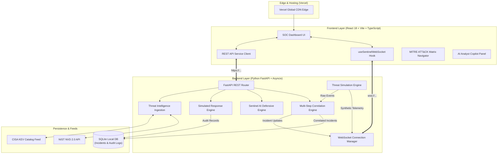
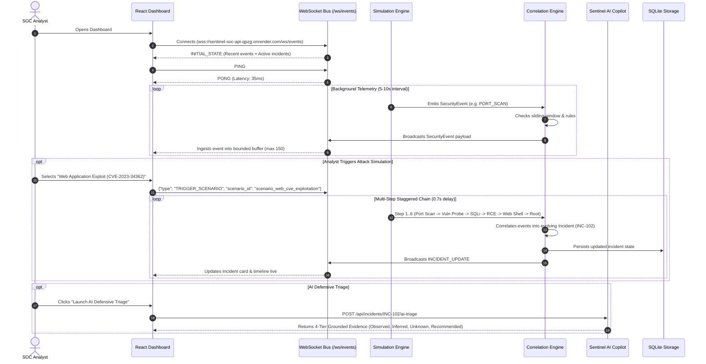

# Sentinel SOC — Architecture & Engineering Specification

> Comprehensive architectural specification for Sentinel SOC: A defensive security operations center platform featuring real-time telemetry streaming, automated multi-stage incident correlation, MITRE ATT&CK enterprise tactic mapping, CISA KEV/NVD intelligence integration, and AI-assisted defensive triage.

---

## 1. High-Level System Architecture

---

## 2. Real-Time Telemetry & WebSocket Pipeline

### Sequence Diagram: Telemetry Flow & Correlation

---

## 3. Data Honesty & Boundary Matrix

Sentinel SOC explicitly segregates synthetic telemetry from public threat intelligence:

| Subsystem | Data Type | Source | Classification | Guarantee |
| :--- | :--- | :--- | :--- | :--- |
| **Telemetry Stream** | Synthetic Log Events | Python Simulation Engine | `SIMULATED` | Uses private IP blocks (`10.0.x.x`, `192.168.x.x`), labeled `simulation: true`. |
| **Attack Chains** | Multi-step Scenarios | Scenario Generator | `SIMULATED` | Follows standard MITRE ATT&CK kill chains in controlled virtual lab. |
| **Correlated Incidents** | Attack Clusters | Correlation Engine + SQLite | `DERIVED (Simulated)` | Formed dynamically from sliding-window pattern matching on telemetry. |
| **NVD Intelligence** | CVE Disclosures & CVSS | NIST National Vulnerability Database | `LIVE` / `CACHED` | Real-world vulnerability metadata from NIST NVD API 2.0. |
| **CISA KEV Catalog** | Known Exploited Catalog | Official CISA KEV JSON Feed | `LIVE` / `CACHED` | Real-world actively exploited CVE catalog with remediation due dates. |
| **AI Analyst** | Threat Triage & Inference | Sentinel AI Copilot Engine | `INFERRED` + `DERIVED` | Grounded breakdown: Observed Facts vs Inferred Hypotheses vs Unknowns. |
| **Response Engine** | Containment Playbooks | Response Service | `SIMULATED` | Strictly simulated actions; zero execution on actual production infrastructure. |

---

## 4. Multi-Stage Incident Correlation Architecture

The `CorrelationEngine` aggregates individual telemetry events into contextual, evolving incidents based on:
1. **Scenario Matching**: Events sharing an active `scenario_id` are grouped into a single unified incident.
2. **Actor & Target Affinity**: Events sharing matching source IPs or target endpoints within active sliding windows are clustered.
3. **Attack Stage Advancement**: Incidents dynamically track progression across 7 distinct attack phases:
   - *Reconnaissance / Network Probe* (`T1046`, `T1595.002`)
   - *Initial Access Attempt* (`T1110`, `T1190`)
   - *Account Compromise* (`T1078`)
   - *Execution & Persistence* (`T1059.001`, `T1055`)
   - *Privilege Escalation & Evasion* (`T1068`, `T1562.001`)
   - *Lateral Movement* (`T1021.002`)
   - *Exfiltration & Impact* (`T1041`, `T1048`, `T1486`, `T1490`)

---

## 5. Sentinel AI Copilot 4-Tier Grounded Contract

When triaging telemetry or incidents, the AI Copilot outputs structured, audited metadata:

- **🟢 OBSERVED (Ground Truth)**: Verifiable facts directly extracted from ingested logs (e.g. source IP, target port, matched signature, event count).
- **🟡 INFERRED (Analytical Hypotheses)**: Probabilistic threat assessments and attacker objectives deduced from observed evidence.
- **⚪ UNKNOWN (Telemetry Blind Spots)**: Explicitly identified gaps in data (e.g. external C2 physical location, darknet credential leakage) to prevent hallucinated conclusions.
- **🔵 RECOMMENDED (Actionable Runbooks)**: Contextual containment, forensic investigation, and long-term hardening steps.

---

## 6. Simulated Response & Audit Logging

Containment actions operate exclusively in simulation mode:
- `[ SIMULATE IP BAN ]`: Simulates boundary gateway packet drop rule.
- `[ SIMULATE FIREWALL BLOCK ]`: Simulates perimeter ACL deny rule across all ports.
- `[ SIMULATE CREDENTIAL REVOCATION ]`: Simulates session token invalidation and password reset.
- `[ SIMULATE HOST ISOLATION ]`: Simulates EDR host network quarantine.

Every action generates an immutable audit record saved to SQLite with `action_id`, `action_type`, `action_label`, `target`, `timestamp`, `triggered_by`, `reason`, and `status` (`SIMULATED SUCCESS`), retrievable via `GET /api/response/audit-log`.

---

## 7. Production Hardening & Security Model

1. **Zero Secrets in Frontend Bundle**: The frontend bundle never receives or embeds private tokens or backend API keys.
2. **Deterministic Runtime URL Resolution**: On remote production domains (e.g. `https://sentinel-soc1.vercel.app`), the client resolves strictly to the production backend (`wss://sentinel-soc-api-qpzg.onrender.com/ws/events`), preventing any localhost leakage.
3. **Bounded Ring Buffers**: Telemetry event streams are bounded (150 in client, 250 in server) to prevent unbounded memory growth.
4. **Resilient Dual-Mode Intelligence**: NIST NVD and CISA KEV services cache data in memory with TTLs and automatically serve baseline vulnerability intelligence during upstream outages.
